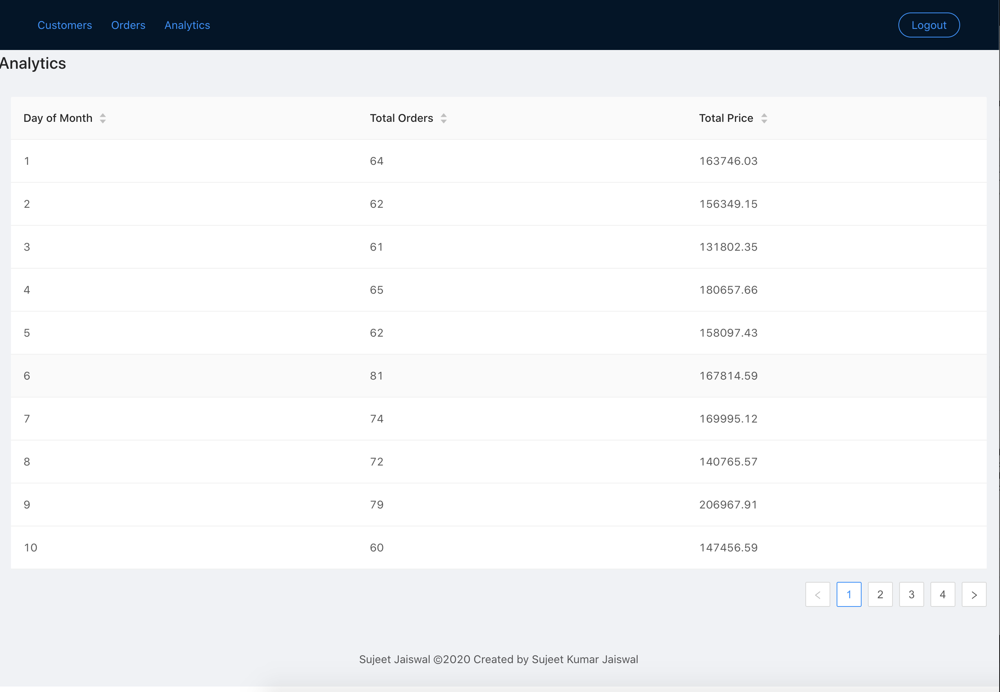
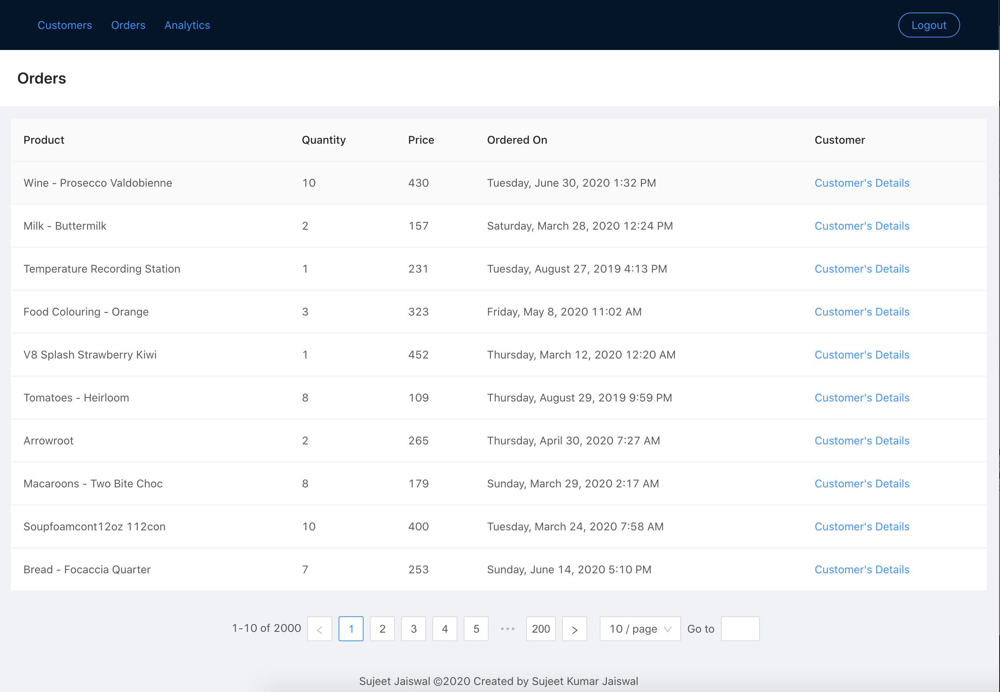
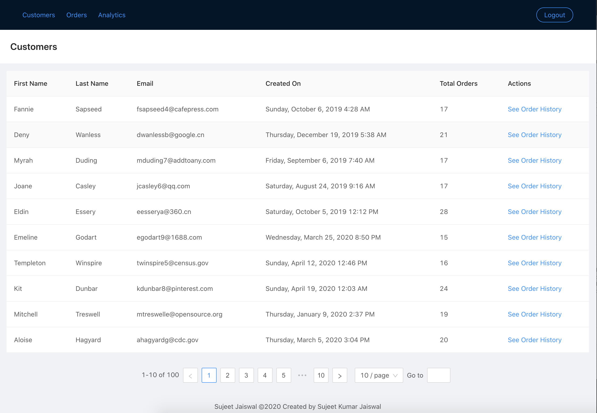
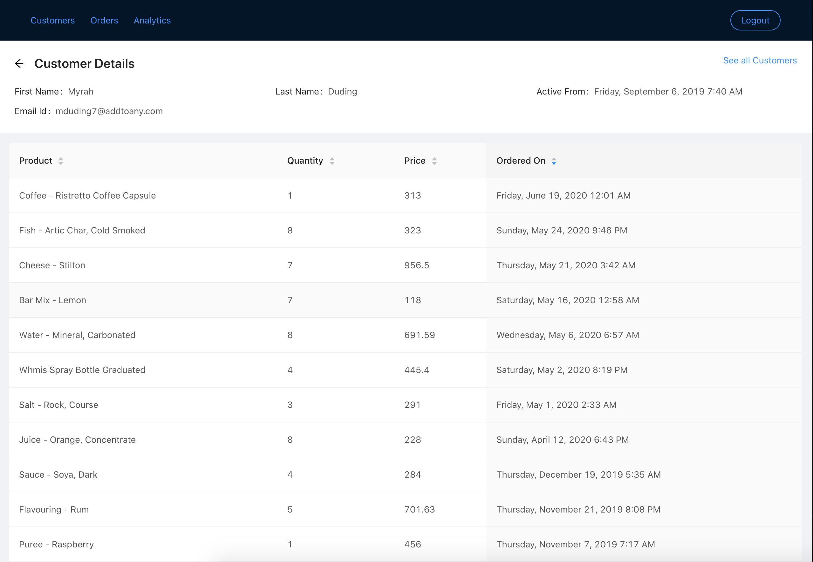

# Feathers Sample Application

## Setting up sample Data

`data/input` folder has two json file one for customers and one for orders.
These files are generated using online sample data generators.

Run `npm start` in order to pre-process the generated files in order to 
map the customer._id to orders randomly and
set the `createdAt` and `updatedAt` to same value

Execute the below commands to import the data to your db.
```shell script
mongoimport --db feather-sample --collection customers --file ./data/output/customers.txt
mongoimport --db feather-sample --collection orders --file ./data/output/orders.txt
```


### Running the server

```shell script
npm start
# for dev mode
npm run dev
```

### Running the client

```shell script
# for local development
npm start
# for build
npm run build
```

### For production deployment

Steps to be setup in jenkins or any other CICD tool

```shell script
# step 1: build the client
cd client
npm install
npm run build
# step 2: move the build files to server/public (replace)
mv -r build/* ../server/public
# step 3: Build the server
npm install
npm run compile
```

Folders for interest/to be deployed to server
```text
server/lib/*
server/public/*
server/package.json
server/package-lock.json
```

## Screenshots of final output

### Analytics Page Screen


### Order's List


### Customer's List


### Customer details page


### Payload screenshot of `/customer`


## How was the setup done

### Server

We are using feathers server. The project setup is done via below commands

```shell script
npm i -g @feathersjs/cli
# name: server (REST), authentication: true (local), mongoose data model for users
# with typescript
feathers generate app 
# customers: Mongoose
feathers generate service
# orders: Mongoose
feathers generate service
# analytics: Custom service
feathers generate service
```

### Client

Using standard `create-react-app`
